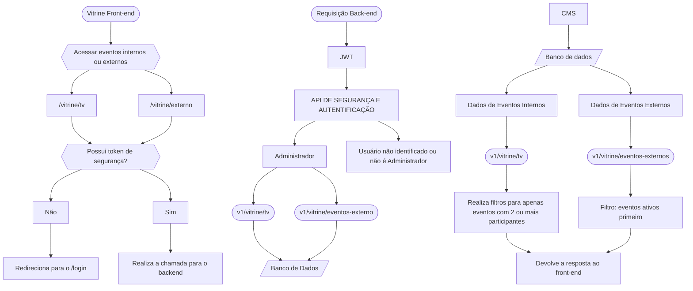

<p align="center">
  <a href="https://fatecregistro.cps.sp.gov.br/" target="blank"></a>
</p>

  <p align="center">Laboratório de Práticas é de realização da <a href="https://fatecregistro.cps.sp.gov.br/" target="_blank">Fatec Registro</a> com o objetivo de acrescentar aos alunos um portfólio, e não menos importante, experiência!</p>
    <p align="center">
<a href="https://www.instagram.com/fatecregistro/" target="_blank"></a>
</p>

<h1 align="center">Vitrine - FrontEnd</h1>

## 📋 Visão Geral
A Vitrine de Projetos é uma interface pública desenvolvida em React/Next.js que permite a visualização e votação em representantes de classes. Este repositório contém o frontend do sistema.

## 💱 Mudança de TypeScript para JavaScript
### Motivação
O projeto foi migrado de TypeScript para JavaScript puro para:

- Simplificar a base de código para equipes menos familiarizadas com TypeScript

- Reduzir a complexidade de configuração

- Manter consistência com outros projetos da organização

- Agilizar o desenvolvimento de novas funcionalidades


## 💥 Impactos
- Removidas todas as definições de tipo (*.d.ts, @types)

- Eliminada a necessidade de compilação TypeScript

- Configurações simplificadas no next.config.js

- Mantida a estrutura de componentes e lógica existente

## ➕ Integrações Principais
### 1. Integração com Backend de Votação
- Endpoint configurável: NEXT_PUBLIC_VITRINE_BE=http://localhost:5001

- Principais funcionalidades integradas:

- Listagem de eventos externos/internos

- Verificação de status de eventos (eventos inativos ficam excluidos)

### 2. Módulo de Segurança
Implementações:

- [](https://jwt.io/): (Para acesso a endpoints protegidos)

## 💻 Requisitos do Sistema
### Dependências principais
- [](https://nodejs.org/pt): Versão 14.x.x ou superior (recomendado 16.x.x/18.x.x)

- [](https://nextjs.org/): 15.2.2+

- [](https://react.dev/): 19.0.0+

- [](https://legacy.reactjs.org/docs/react-dom.html): 19.0.0+

## 💾 Dependências adicionais
- Geração de QR Code (qrcode.react)

- Geração de PDF (react-to-pdf, jspdf)

- Captura de tela (html2canvas)

- Ícones (react-icons)

## 📲 Responsividade para Escala 100%

Se tornou necessária o ajuste para um melhor escalonamento. Garantir que a aplicação mantenha uma experiência consistente e funcional em diferentes dispositivos com escalas de zoom em 100%.

### Testes em Diferentes Níveis de Zoom

Verificação com

100% (padrão e selecionada)

125% e 150% (comum em acessibilidade)

200% (casos extremos para validação)

### Acessibilidade em Textos

Garantir que textos não quebrem layout em zoom alto.

### Impacto Esperado
Melhoria na experiência de usuários que utilizam zoom por necessidade visual.

Layout mais consistente em diferentes dispositivos e configurações de tela.

## 🏠 Configuração e Execução

> [!IMPORTANT]
> Previamente a iniciação do projeto, é preciso realizar algumas configurações.

```bash
1. Clonar o repositório


git clone https://github.com/laboratorio-de-praticas/vitrine-fe.git

cd vitrine-fe


2. Instalar dependências

npm install


3. Configurar variáveis de ambiente

Crie um arquivo .env.local com:

PORT=3001

NEXT_PUBLIC_VITRINE_BE=http://localhost:5001


4. Executar o projeto

npm run dev  # Modo desenvolvimento
# ou
npm start    # Modo produção (após build)
```

## 📁 Estrutura do Projeto (Principais Diretórios)
```
vitrine-fe/
├── components/      # Componentes reutilizáveis
├── public/          # Assets estáticos
├── app/             # Páginas de Redirecionamento com Next.js
└── styles/          # Estilos globais
```


## 📖 Diagramação - Vitrine 
>[!NOTE]
> Organograma Documentado de todas as Requisições e Redirecionamentos da Sessão de Vitrine.


